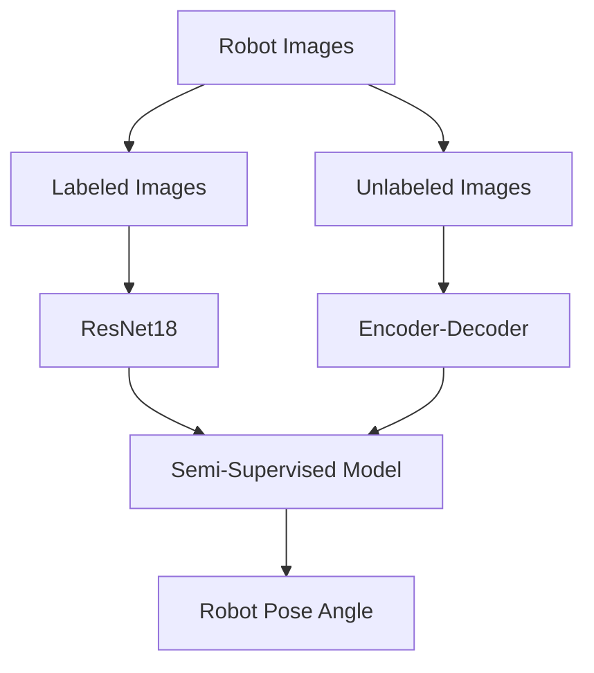

# Semi-Supervised Robot Pose Estimation

## Project Overview

This project presents a complete semi-supervised learning framework for robot pose estimation.

The objective was to accurately estimate the orientation of a robotic object while minimizing the amount of labeled training data required.

The proposed solution combines supervised and unsupervised deep learning into a unified pipeline.

---

## Project Architecture

The project consists of three main stages.

### 1. Supervised Model

A ResNet18-based regression model was trained to estimate the robot's orientation from labeled images.

During this stage, two different loss functions were investigated and compared in order to evaluate their influence on angle estimation accuracy.

---

### 2. Unsupervised Model

An Encoder-Decoder (Autoencoder) architecture was trained using unlabeled robot images.

The objective was to learn meaningful visual representations without requiring manual annotations.

---

### 3. Semi-Supervised Model

The learned representations produced by the unsupervised model were integrated with the supervised ResNet18 model.

This combination allowed the final model to leverage both labeled and unlabeled data, improving robustness and reducing dependency on manual labeling.

---

## Repository Contents

- `supervised_model.ipynb`
  - ResNet18 pose estimation
  - Comparison of two regression loss functions

- `unsupervised_autoencoder.ipynb`
  - Encoder-Decoder architecture
  - Representation learning from unlabeled images

- `semi_supervised_model.ipynb`
  - Integration of supervised and unsupervised models
  - Final semi-supervised framework

---

## Technologies

- Python
- PyTorch
- OpenCV
- NumPy
- Matplotlib

---

## Skills Demonstrated

- Machine Learning
- Deep Learning
- Computer Vision
- Semi-Supervised Learning
- Representation Learning
- Autoencoders
- ResNet18
- Pose Estimation
- Regression
- Model Training

