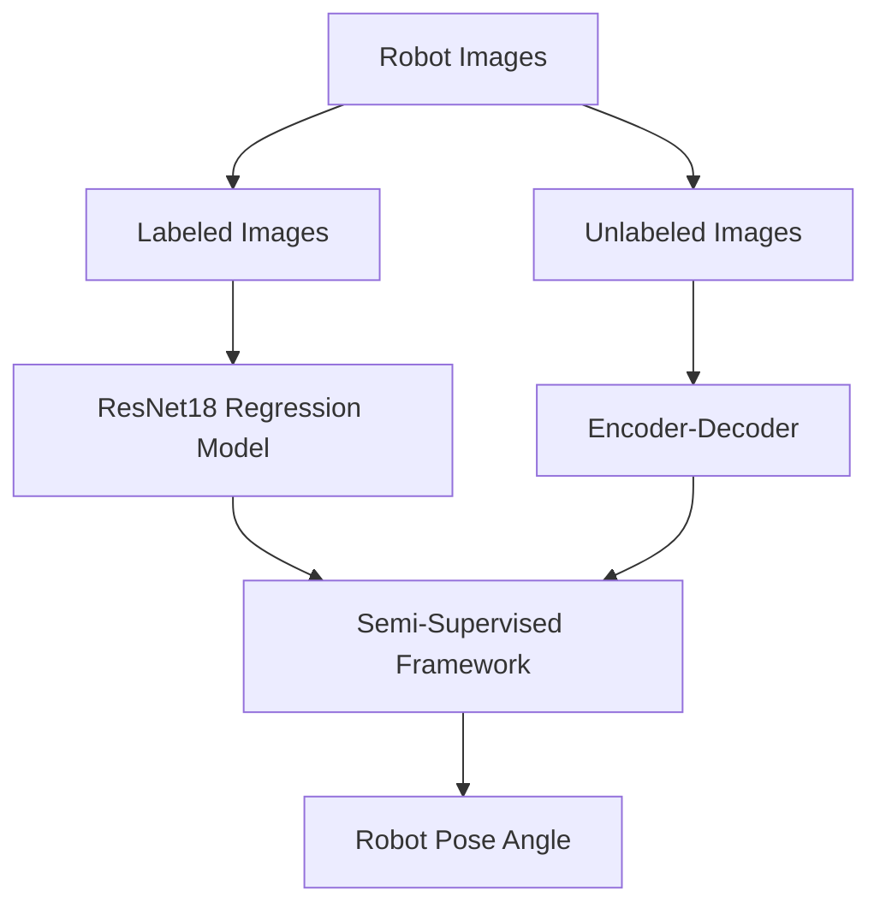

# Semi-Supervised Robot Pose Estimation

## Project Overview

This project presents a complete semi-supervised deep learning framework for robot pose estimation.

The objective was to accurately estimate the orientation (angle) of a robotic object while minimizing the amount of labeled training data required.

The proposed solution combines supervised learning and unsupervised representation learning into a unified semi-supervised pipeline, enabling the model to leverage both labeled and unlabeled images.

---

## Project Architecture

The project consists of three complementary stages.

### 1. Supervised Model

A ResNet18-based regression model was trained using labeled robot images to estimate the robot's orientation.

During this stage, two different regression loss functions (standard MSE loss & circular angular loss specifically designed for orientation estimation) were investigated and compared in order to evaluate their impact on degree estimation accuracy.

---

### 2. Unsupervised Model

An Encoder-Decoder (Autoencoder) architecture was trained using unlabeled robot images.

The purpose of this stage was to learn meaningful visual representations without relying on manual annotations, allowing the model to extract informative features from the unlabeled dataset.

---

### 3. Semi-Supervised Model

The learned feature representations generated by the Encoder-Decoder were integrated with the supervised ResNet18 regression model.

The resulting semi-supervised framework combines information from both labeled and unlabeled data, reducing dependency on manual labeling while improving the robustness of the pose estimation pipeline.

---

## Repository Contents

- `supervised_model.ipynb`
  - ResNet18-based pose estimation
  - Comparison of two regression loss functions

- `unsupervised_model.ipynb`
  - Encoder-Decoder architecture
  - Representation learning from unlabeled images

- `semi_supervised_model.ipynb`
  - Integration of supervised and unsupervised models
  - Complete semi-supervised pose estimation framework

---

## Dataset

The project was developed using both labeled and unlabeled robot images.

The labeled dataset was used to train the supervised regression model, while the unlabeled dataset enabled representation learning through the Encoder-Decoder model.

---

## Results

The final semi-supervised framework demonstrates how unlabeled data can be effectively utilized to enhance robot pose estimation while reducing reliance on large labeled datasets.

The project illustrates the practical application of semi-supervised learning techniques for computer vision tasks where manual annotation is expensive or limited.

---

## Technologies

- Python
- PyTorch
- OpenCV
- NumPy
- Matplotlib
- Jupyter Notebook

---

## Skills Demonstrated

- Machine Learning
- Deep Learning
- Computer Vision
- Semi-Supervised Learning
- Representation Learning
- Autoencoders
- ResNet18
- Pose Estimation
- Image Regression
- Loss Function Analysis
- Model Training
- Feature Extraction

---

## Project Pipeline

---

## Future Improvements

- Self-supervised pretraining
- Vision Transformers (ViT)
- Larger and more diverse datasets
- Domain adaptation
- Real-time pose estimation
- Additional regression loss function evaluation
